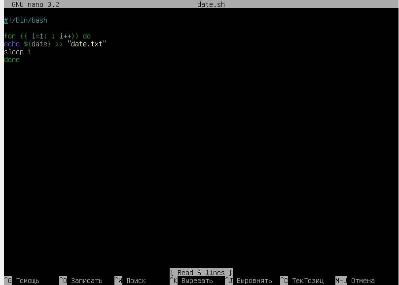
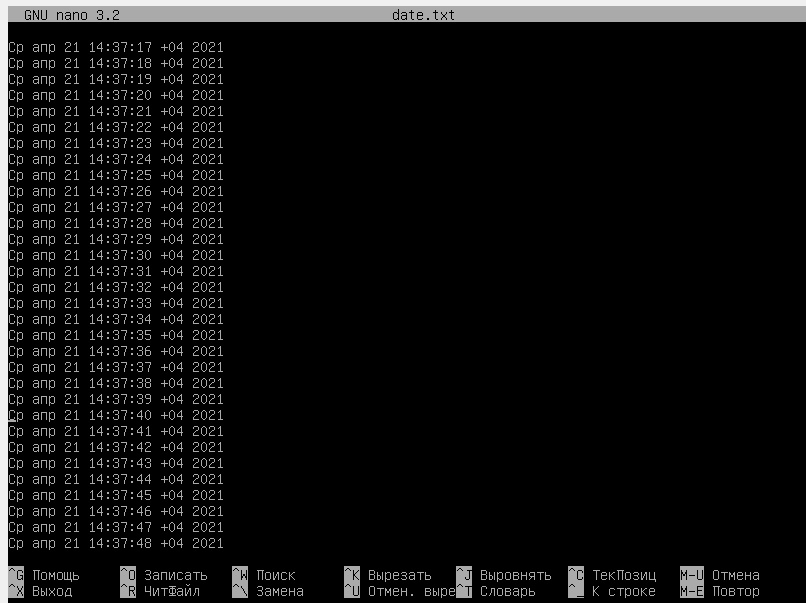
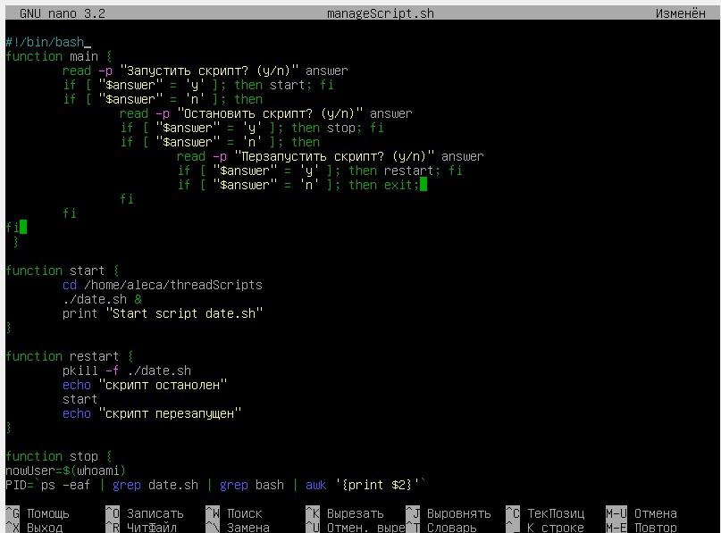
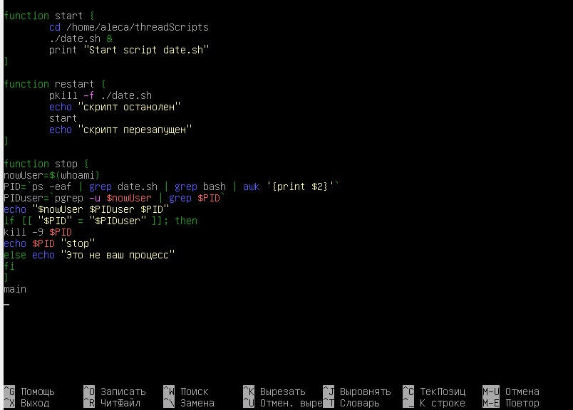
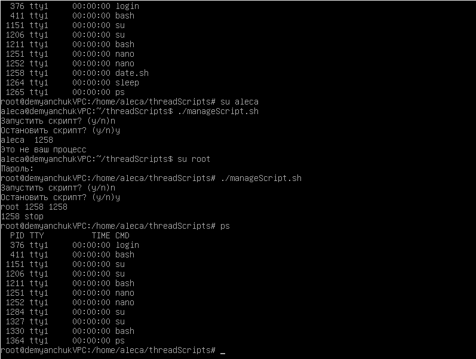

# OS

# Лабораторная работа № 3

## 1. Код скрипта который печатает в текстовый файл каждую секунду дату и время:

## Результат: 

## 2. Скрипт для запуска, остановки и перезапуска скрипта date.sh:

## В алгоритме остановки скрипта мы вычисляем PID процесса и PIDuser процесса (проверяем запустил ли пользователь нужный нам процесс). Если PID и PIDuser совпадают, значит все верно, процесс запущен текущим пользователем и мы можем его остановить. Иначе нам будет отказано в доступе.

## Работа скрипта:

## 3. Видео работы лабораторной работы:
https://disk.yandex.ru/i/CAEI4bko4BWYpA
