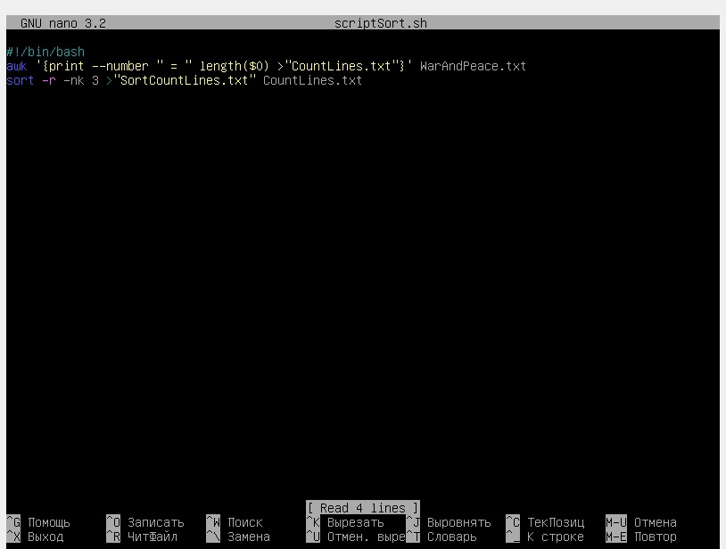
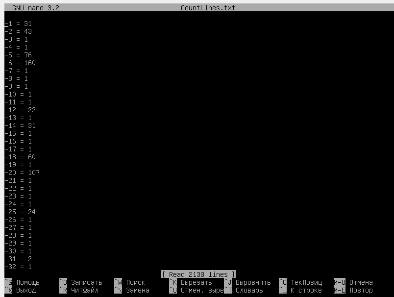
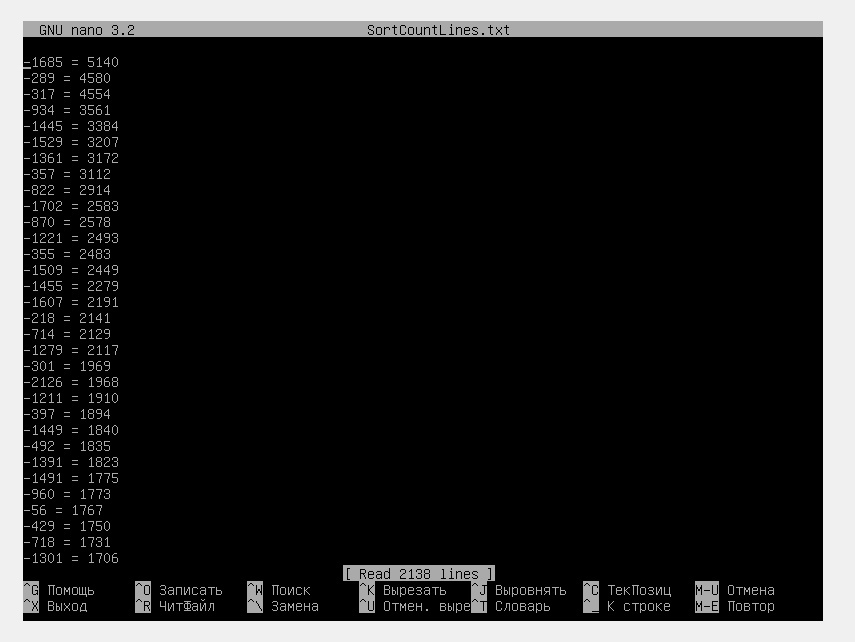

# OS

## Лабораторная работа № 2 ( усложненная часть)
## Выполнила студентка группы ПИбд-21
### Задание: отсортировать строки "Война и мир" по кол-ву символов, сделать это в файл : номер строки = кол-во символов, сортировка должна быть по убыванию.

## Код скрипта:

### Алгоритм работы: в файл "CountLines.txt" записываем информацию в формате "номер строки" = кол-во символов в этой строке, затем сортируем этот файл, результат пишем в SortCountLines.txt. -r позволяет выполнить сортировку по убыванию.

## Содержимое файлов с результатами работы:

